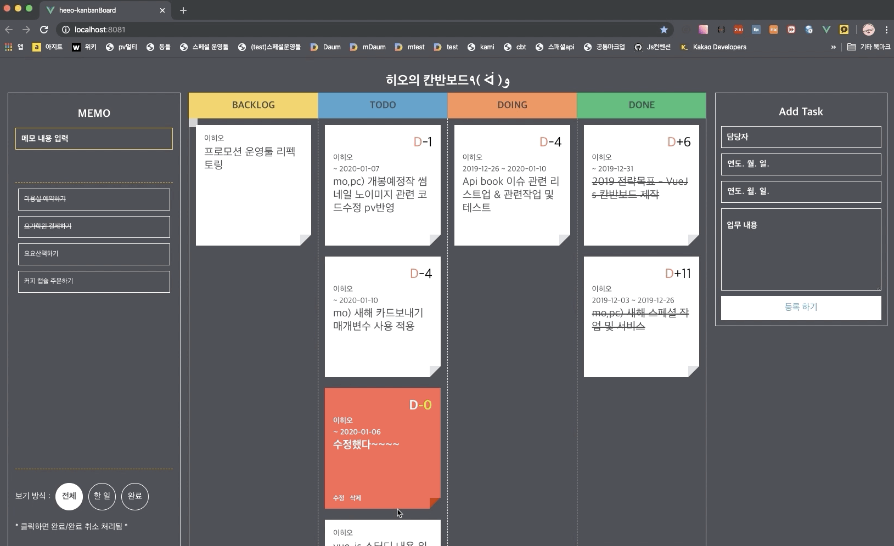

# Vue Js를 이용한 칸반 보드 제작
## 기능
### 칸반보드
1. 생성
2. 수정
3. 삭제
4. 드래그 드랍을 이용한 상태 이동
5. 로컬 스토리지 저장
6. 디데이 임박 및 예상일정 초과시 asap 스타일 추가
7. 완료 시 선 긋기 스타일 등 디자인 추가
### 메모(업무 외 일정 등록)
1. 생성
2. 수정
3. 삭제
4. 클릭이벤트를 이용한 상태 변경
5. 할일/종료/전체 3가지 상태로 구분
6. 로컬 스토리지 저장 

## 구현 화면

## 해야 할 것
- [x] 마크업 및 css 가이드 준수 및 필요없는 마크업, 코드 삭제
- [x] 필요없는 코드 삭제
- [x] 메모 영역 높이 고정 및 스크롤 추가
- [x] 메모, 블록 등 말줄임
- [x] 칸반의 블록 수정 및 삭제 기능 추가
- [x] vue-kanban 컴포넌트 불러오기 위한 환경 셋팅 vue-kanban/dragula/lodash/faker 설치
- [x] 드래드/드랍 기능 확인
- [x] 데이터 입력 받아서 블록 생성(faker 말고 실제 데이터 받는걸로 수정)
- [x] 디데이 계산
- [x] 종료시간 입력하지 않은 경우 디데이 텍스트 미노출 처리  
- [x] 메모장 기능(생성/삭제/보기 옵션)
- [x] 메모, 블록에 수정/삭제 기능 추가
- [x] 수정 취소 기능 추가
- [x] DONE 처리 css 추가
----------------- 시간 관계상 추후작업 예정 -----------------
- [ ] 설치한 플러그인 중 필요없는 것 추후 삭제
- [ ] dragula 클래스 수정 가능하다면 언더바적용
- [ ] 리펙토링(slot 삭제 및 세부 컴포넌트화)
- [ ] 마크업 코드리뷰
- [ ] vueJs 코드리뷰
